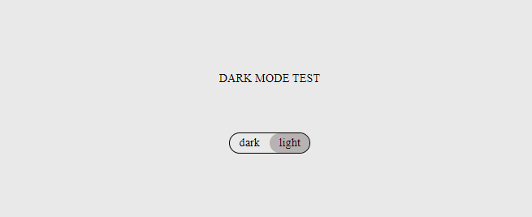

# react-dark-mode-switch

> fancy checkbox to do whatever but styles as dark mode switch

[](https://www.npmjs.com/package/react-dark-mode-switch) [](https://standardjs.com)

## Install

```bash
npm install --save react-dark-mode-switch
```

## Default look


## Usage

```tsx
import React, { Component } from 'react'
import DarkModeToggle from 'react-dark-mode-switch'
const darkModeClass="darkMode"

export default class App extends Component {
    state = {
    darkMode: false
  }

  toggleChecked = (event) => {
    this.setState({ darkMode: event.target.checked });
  }
  render() {
    return (
      <div className={`App ${this.state.darkMode? darkModeClass: ""}`}>
        DARK MODE TEST
        <DarkModeToggle
          /* required */
          toggleChecked={this.toggleChecked}
          isChecked={this.state.darkMode} 
          /* optional working default values are provided */
          darkLabel="dark" 
          lightLabel="light" 
          activeClass="darkActive"
          id="darkModeToggle" 
        />
      </div>
    )
  }
}
```


## Props

| Prop          | Type     | Required | Description                                                                                                                              |
|:--------------|:---------|:--------:|:-----------------------------------------------------------------------------------------------------------------------------------------|
| isChecked     | Boolean  |    ✓     | Value of checkbox                                                                                                                        |
| toggleChecked | Function |    ✓     | Function to change isChecked. Does actually get you the event value event.target.checked                                                 |
| id            | String   |          | Pass your own id to the container. Preferably use this to apply your own styles since it overwrites the intern styles without !important |
| className     | String   |          | Pass your own className to the wrapper                                                                                                   |
| activeClass   | String   |          | ClassName that gets added to the container when isChecked is true (default "DMT_Active")                                                 |
| className     | String   |          | Can be used to add your own className to parent component                                                                                |
| darkLabel     | String   |          | String that gets displayed in the left half of the container (default "dark")                                                            |
| lightLabel    | String   |          | String that gets displayed in the right half of the container (default "light")                                                          |


## License

MIT © [https://github.com/kantimam](https://github.com/https://github.com/kantimam)
